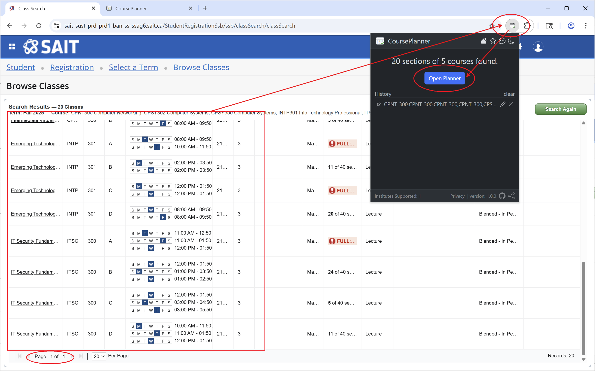
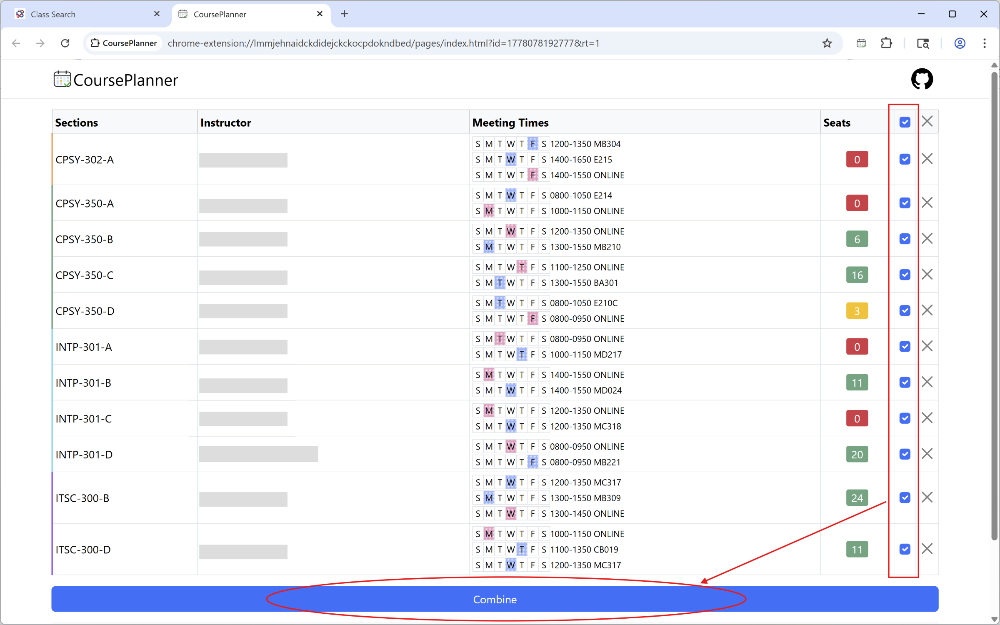
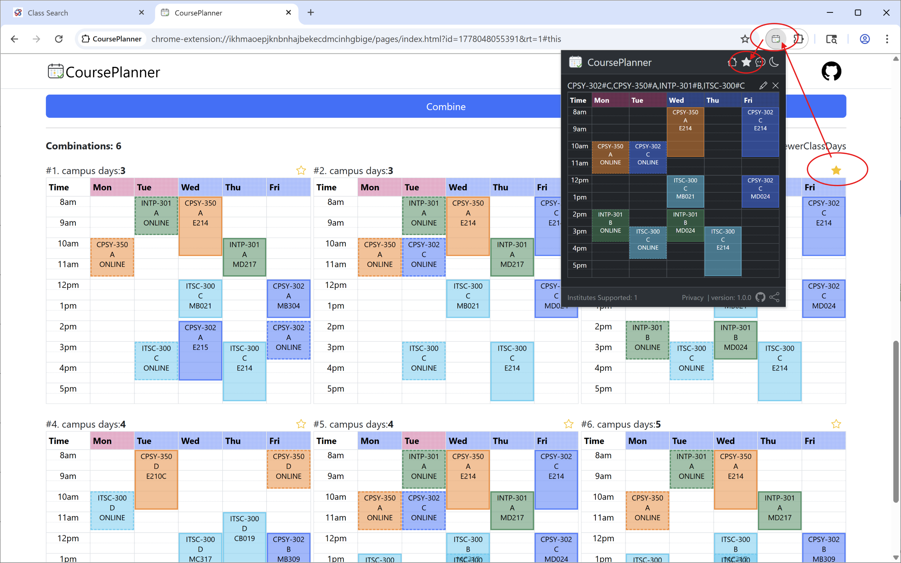

# Course Planner

Course Planner is a browser extension that helps students extract course information and build conflict-free class schedules more easily.

---

## Features

- Extract course and section information from supported registration pages
- Detect available courses directly from the current page
- Generate possible conflict-free schedule combinations
- Compare schedules and choose the best fit
- Support multiple institutions through modular parsers

---

## Supported Browsers

- Google Chrome
- Microsoft Edge
- Mozilla Firefox

---

## How It Works

### 1. Open a Supported Course Registration Page

Visit a supported course registration page that contains available courses and sections.

### 2. Extract Courses

Click the extension icon and extract detected course information from the page.

### 3. Build Schedules

Open Planner, select candidate courses, and generate conflict-free schedule combinations.

---

## Demo Website

Demo: https://demo.saiter.ca

### Demo Steps

1. Select a term and choose a program on the left panel.
2. Available courses and sections will appear on the right side.
3. Click the extension icon to extract course information.
4. Click **Open Planner** to generate possible schedules.

---

## Privacy

Course Planner is designed with privacy in mind.

- All course data is processed locally in the browser
- Course information is not uploaded to any server
- Email addresses are only collected if voluntarily submitted through the feedback form

Privacy Policy: https://saiter.ca/privacy

---

## Development

### Project Structure

src/
- _locales/
- assets/
- institutes/
- pages/
- popup/
- background.js
- manifest.json

### Load Extension Locally

1. Open `chrome://extensions`
2. Enable **Developer mode**
3. Click **Load unpacked**
4. Select the project folder

For Microsoft Edge, open `edge://extensions` and follow the same steps.

---

## Technologies

- Chrome Extension Manifest V3
- JavaScript
- HTML / CSS
- Bootstrap 5

---

## Contributing

We welcome community contributions.

If you would like to add support for a new institution or improve support for an existing one, please check the `src/institutes` folder and feel free to submit a pull request.

---

## License

MIT License